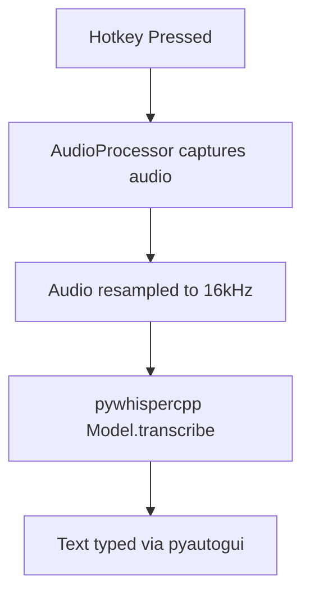
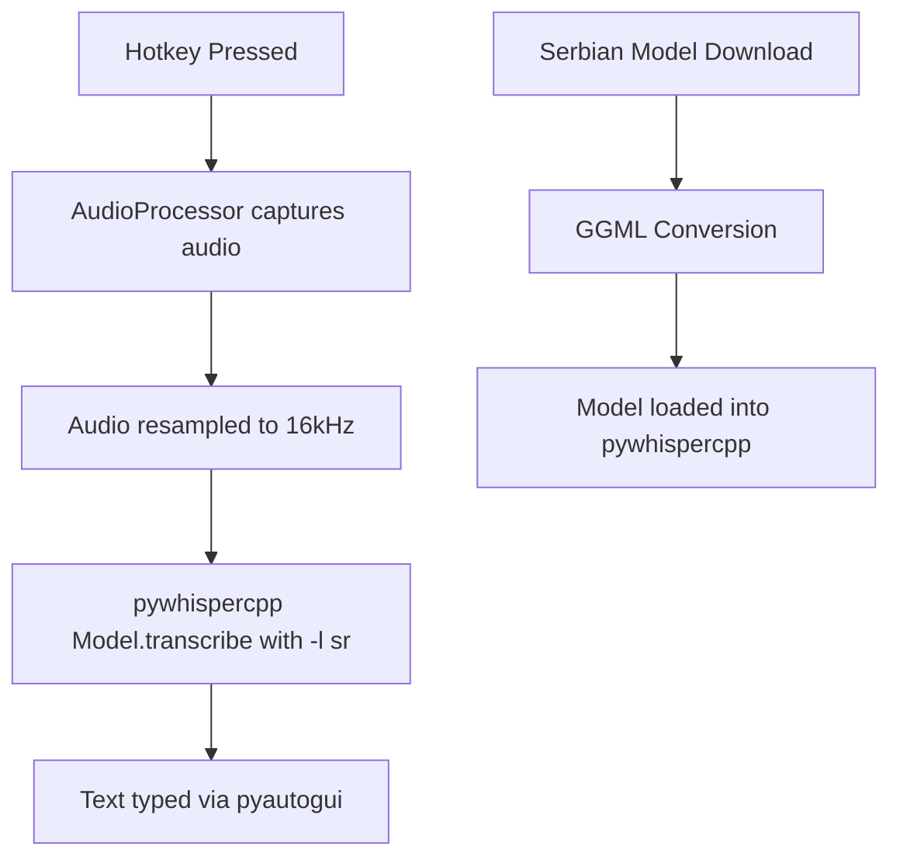

# Serbian Whisper.cpp Integration Plan

## Overview
Integrate Serbian language support into the existing Daktilograf dictation tool using fine-tuned Whisper models from Hugging Face.

## Current Architecture


## Proposed Architecture


## Implementation Details

### 1. Model Selection
| Model | Size | Accuracy | Speed | VRAM Required |
|-------|------|----------|-------|---------------|
| whisper-base + -l sr | 74MB | Medium | Fast | ~1GB |
| whisper-medium + -l sr | 769MB | Good | Medium | ~2GB |
| DrishtiSharma/whisper-large-v2-serbian | ~3GB | Excellent | Slow | ~4GB |
| Sagicc/whisper-medium-sr-yodas | ~769MB | Very Good | Medium | ~2GB |

**Recommendation**: Start with `Sagicc/whisper-medium-sr-yodas` for best accuracy/speed balance.

### 2. Files to Modify

#### `modules/config.py`
- Add `LANGUAGE = 'sr'` constant
- Add `SERBIAN_MODEL_URL` for Hugging Face model
- Add streaming parameters: `STEP_MS = 3000`, `LENGTH_MS = 10000`

#### `offline_dictation_whisper.py`
- Add `--language` CLI argument (default: 'sr')
- Update `load_whisper_model()` to accept language parameter
- Pass language to `model.transcribe()` via kwargs

#### `modules/audio_processor.py`
- Add streaming window parameters for real-time processing
- Support configurable step/length intervals

#### `run_dictation.sh`
- Add `--language` flag support
- Auto-detect Serbian model path

### 3. New Files

#### `scripts/download_serbian_model.py`
```python
# Downloads Hugging Face model and converts to GGML format
# Uses convert-h5-to-ggml.py from whisper.cpp
```

#### `scripts/setup_serbian.sh`
```bash
# One-time setup script for Serbian model
# 1. Clone whisper.cpp (if needed)
# 2. Install conversion dependencies
# 3. Download and convert model
```

### 4. pywhispercpp Language Support
The pywhispercpp library supports language via the `language` parameter:
```python
model.transcribe(audio_data, language='sr', n_processors=1)
```

This is equivalent to whisper.cpp's `-l sr` flag.

### 5. Key Implementation Notes

- **Language Code**: Use 'sr' for Serbian (ISO 639-1)
- **Force Language**: Skip auto-detection by specifying language explicitly
- **Threading**: Increase `n_threads` in Model constructor for better performance
- **Model Path**: Store Serbian models in `./model/serbian/` directory

### 6. Testing Strategy
1. Test with various Serbian phrases
2. Compare accuracy: base model vs fine-tuned model
3. Measure latency with different step/length parameters
4. Validate UTF-8 Serbian character output

## Acceptance Criteria
- [ ] Serbian speech transcribed with >90% accuracy on test phrases
- [ ] No auto-detection lag (language forced to Serbian)
- [ ] Configurable via command-line --language flag
- [ ] Documentation updated with setup instructions
- [ ] Existing English transcription still works (backward compatible)
